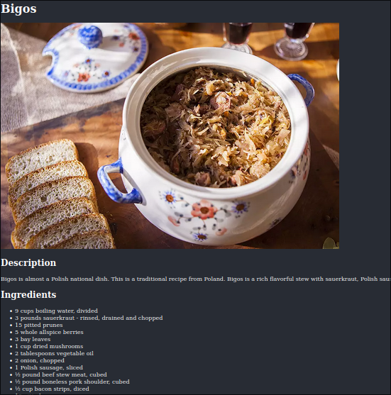

# Odin recipes
This is the very first project from the (amazing) [The Odin Project curriculum](https://www.theodinproject.com/).
It's an incredibly basic page featuring basic recipes and pictures of them.

# Skills
### After completing it, I gained:
Basic HTML knowledge (Using Lists, adding images, Usage of headers and paragraphs.)
Basic CSS knowledge (Basic styling, Changing the size of the text, Changing the color of the text and background)
# Tech
### This project was made with:
HTML
CSS
# Live Preview
See the page in the [Live Preview](https://pawys.github.io/odin-recipes/)
